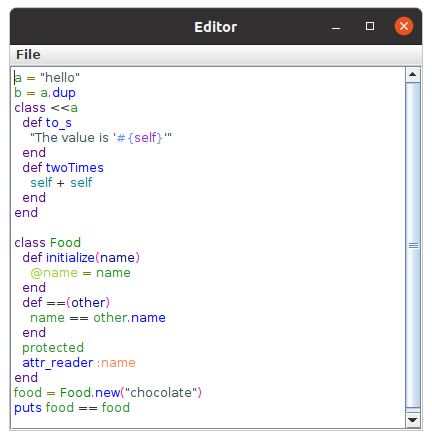

# Code Editor for Ruby
## Describtion
Simple Ruby code editor that implements syntax highligh using `tree-sitter`.

## Project Structure

- `./src` contains code editor source files
- `./screenshots` include a screenshot of the editor
- `query.scm` patterns to highlight
- `typeIdToColor.txt` is a color scheme for highlighting
- `textExample.txt` is an example of a Ruby code, that is preloaded into the editor

## How to Build

#### Dependencies
- Ubuntu 20.04
- Java 11.0.11
- gcc, g++ 9.3.0
- make (to build tree-sitter library)
 
#### Steps to build

1) First of all you need to build `tree-sitter`
```sh
cd tree-sitter
make
cd ..
```
2) Compile Ruby scanner from `tree-sitter-ruby`
```sh
g++ -fpic -shared -I tree-sitter/lib/include  tree-sitter-ruby/src/scanner.cc -o libscan.so
```
3) Compile JNI bridge for `tree-sitter`
```sh
gcc  -fPIC  -shared -I /usr/lib/jvm/{OPEN_JDK_PATH}/include -I /usr/lib/jvm/{OPEN_JDK_PATH}/include/linux -I tree-sitter/lib/include tree-sitter-ruby/src/parser.c  src/Treesitter.c -o  libjnicode.so -Ltree-sitter -l:libtree-sitter.a -L. -Wl,-rpath=. -Wall  -lscan -w
```

For me the `{OPEN_JDK_PATH}` is `java-11-openjdk-amd64`

4) Compile all .java files in `/src` folder
```sh
javac -d . src/*.java 
```
5) Run Editor
```sh
java -Djava.library.path=. Editor
```

#### Contact
In case of any problems text to mgslutskiy@gmail.com
